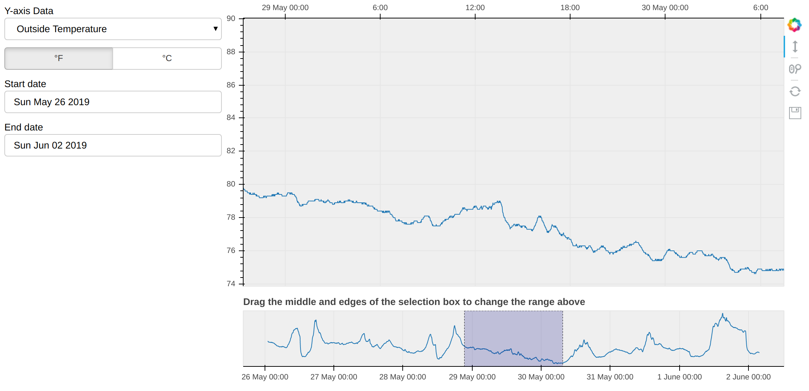
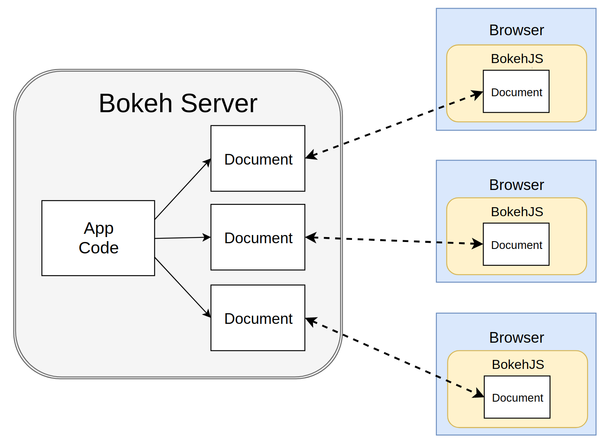
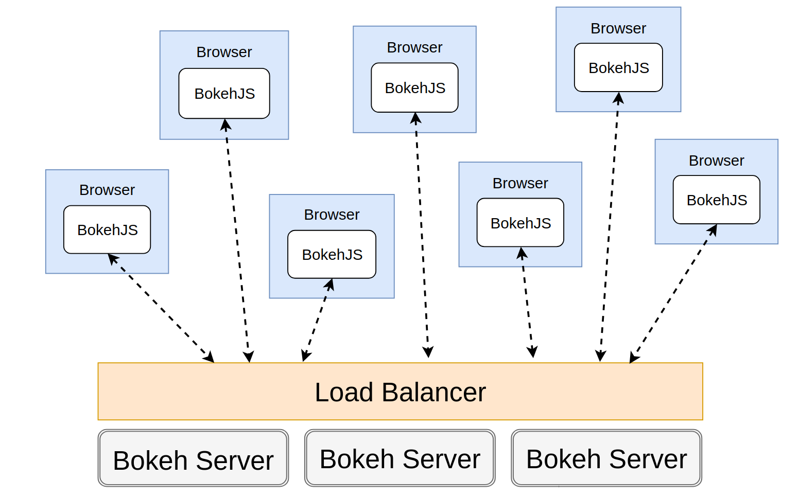
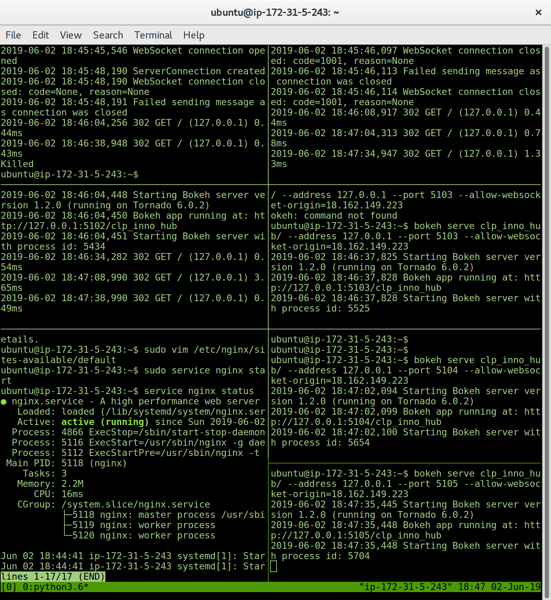

# Observatory Data



This project process and visualize the data extracted from the Davis Cloud server on a website hosted in AWS EC2 server and is accessible by the Internet: [Link Expired](google.com).

Each time you refresh the website it will pull the lastest data using the API call and re-render the chart. You may select the y-axis Data to be displayed and the x-axis is always the datetime. Choosing the start date and end date will filtered the data on chart with the date range. You may also change the datetime range with the selection box below the chart.

## Getting Started

### Built With

The Python environment is 3.6. Packages used including:
* [Pandas](https://pandas.pydata.org/) - the data analysis library
* [Bokeh](https://bokeh.pydata.org/en/latest/) - Interactive visualization library targets modern web browsers

### Deployment

The website is deployed on an AWS EC2 server in Hong Kong availability zone. Nginx is used on the Linux server as the HTTP and reverse-proxying server. The server configuration block is as shown below:
```
server {
    listen 80 default_server;
    server_name _;

    access_log  /tmp/bokeh.access.log;
    error_log   /tmp/bokeh.error.log debug;

    location / {
        proxy_pass http://127.0.0.1:5000;
        proxy_set_header Upgrade $http_upgrade;
        proxy_set_header Connection "upgrade";
        proxy_http_version 1.1;
        proxy_set_header X-Forwarded-For $proxy_add_x_forwarded_for;
        proxy_set_header Host $host:$server_port;
        proxy_buffering off;
    }

}
```

After configuring the Nginx server and start the Nginx service, run the application from its parent directory as below:
```
bokeh serve observatory_data_plot/ --address 127.0.0.1 --port 5000 --allow-websocket-origin=18.162.x.x
```

The configuration sets up Nginx to proxy incoming connections to 127.0.0.1 on port 80 to 127.0.0.1:5000 internally. Running the application with flags ```--allow-websocket-origin=18.162.x.x``` means to allow websocket connection from the EC2 public domain name. Since the public ip address is dynamically arranged by the server each time rebooting the EC2 instance, I hooked the ip address to my domain name for easier access the website.

### How it works


A Bokeh server (left) uses Application code to create Bokeh Documents. Every new connection from a browser (right) results in the Bokeh server creating a new document, just for that session. 



To Further increase the performance of the application, load balancing function of Nginx is used together with the scalable features of Bokeh server. Mulitiple Bokeh server instances is loaded such that new connections are distributed amongst the individual servers.



In this application, 5 Bokeh servers is loaded to share the workload of multiple connections.

## Further Work for a production ready app component

The entire Bokeh server applications can be embedded into other python script or HTML page. This can be accomplished with the function in the bokeh.embed python modules, which accepts the URL to a Bokeh server apllication, and returns a script that will embed new sessions from the server any time is script is executed. Running the code in python:

```
from bokeh.embed import server_document
script = server_document("http://12.0.0.1:5000/observatory_data_plot")
```

The returned script tag will look something like this:

```
<script
    src="http://127.0.0.1:5000/observatory_data_plot/autoload.js?bokeh-autoload-element=1001&bokeh-app-path=/observatory_data_plot&bokeh-absolute-url=http://127.0.0.1:5000/observatory_data_plot" id="1001">
</script>
```

It can be templated in an HTML page to include the Bokeh application at that point.